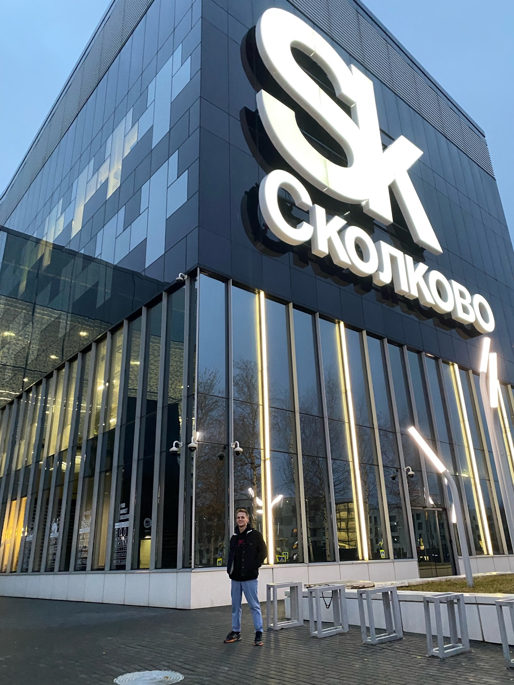

<h1 align="center">Hi 👋, I'm Andrianov Roman</h1>

<h3 align="center">A passionate frontend developer</h3>

---

<h3 align="left">About me:</h3>

- 📄 My name is Andrianov Roman!

- ⚡ I'm 22 years old, I'm a frontend developer!

- 👨‍💻 I've been doing frontend for 2 years now!

- 🤝 I develop turnkey websites using layouts from Photoshop and Figma!

---
<h3 align="left">Connect with me:</h3>

[Telegram](https://t.me/RollyForce)

---

<h3 align="left">Technologies:</h3>

    
    
    
    
    
<!--      -->

---

<h3 align="left">Tools:</h3>

 

---
